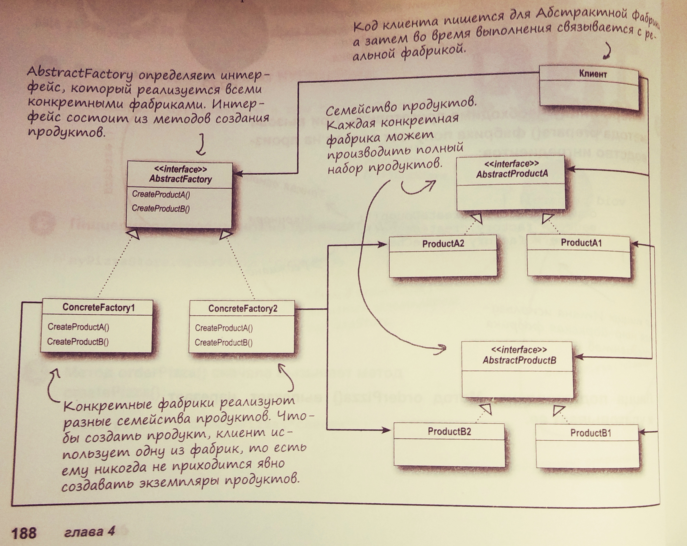

В книге приведены два варианта паттерна **Фабрика**: **Фабричный метод** и **Абстрактная фабрика**. 
В преддверии этих паттернов приведена идиома **Простая фабрика** - 
это еще не паттерн, но вещь очень полезная.

Суть всех фабрик - отделить создание объекта от его использования.
Пусть есть класс-продукт. Конкретные экземпляры продукта должны создаваться отдельно от кода,
где этот продукт используется.

Если следовать идиоме **Простая фабрика**, то метод создания продукта выносится в отдельный класс (это и есть простая фабрика).
Все остальные части приложения, если им потребуется продукт, обращаются к простой фабрике.

Простая фабрика: 

Фабричный метод: 

Абстрактная фабрика:
