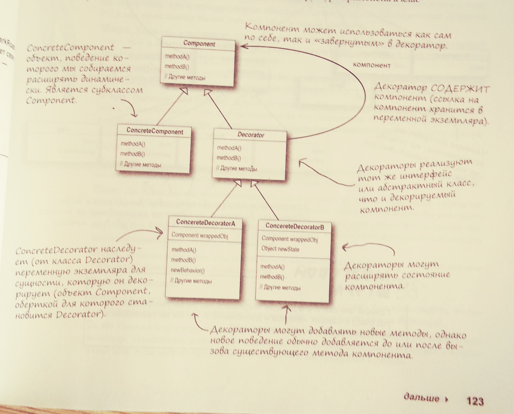

Паттерн **Декоратор** позволяет расширить поведение объекта без изменения 
существующего кода.

Декоратор реализует тот же "интерфейс", что и исходный класс. 
От класса-декоратора наследуются классы, которые реализуют конкретное "дополнительное" поведение:

Паттерн **Декоратор** добавил еще один принцип в копилку принципов проектирования:
- Классы должны быть **открыты** для расширения, но **закрыты** для изменения.

А вот и остальные:
- Инкапсулируйте то, что изменяется.
- Отдавайте предпочтение композиции перед наследованием.
- Программируйте на уровне интерфейсов, а не реализации.
- Стремитесь к слабой связности взаимодействующих объектов.
